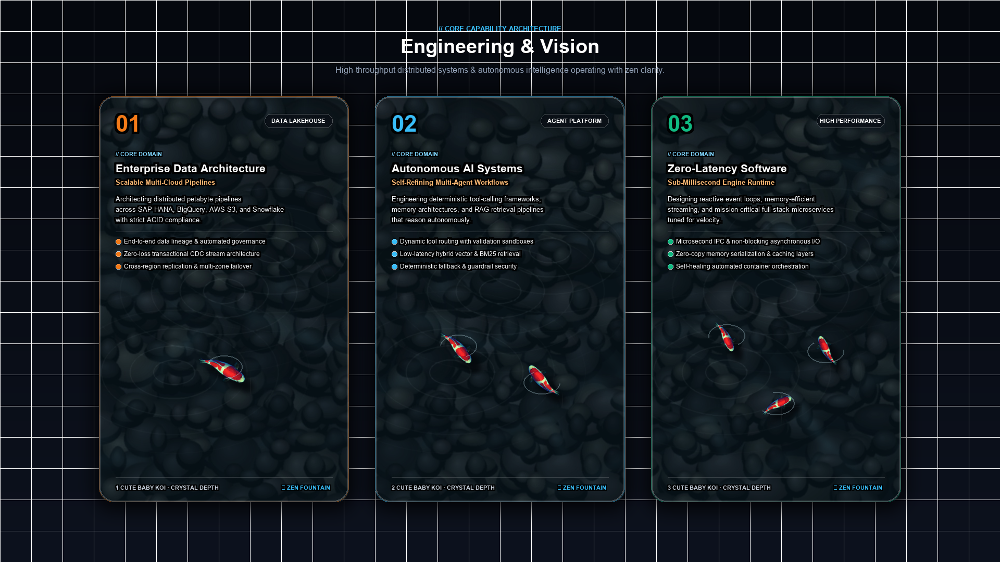

<div align="center">

# 🌌 Shaik Mastan Vali — Ultra-Luxury Portfolio

### **SAP BODS Developer • AI Systems Builder • Full-Stack Developer**
*Crafting Ultra-Luxury Digital Experiences, High-Throughput Data Architectures & Autonomous AI Systems.*

[](https://nextjs.org/)
[](https://react.dev/)
[](https://www.typescriptlang.org/)
[](https://tailwindcss.com/)
[](LICENSE)

<br />

<!-- Real Portfolio Live View Header -->


</div>

---

## 🌟 Portfolio Experience & Signature Engineering

A world-class personal developer portfolio engineered with obsession over visual fidelity, micro-interactions, liquid physics, and sub-millisecond execution.

### 🎭 Live Interactive Highlights:
1. **Interactive Zen Koi Pond System**: Custom HTML5 Canvas fluid simulation with multi-segment procedural swimming kinematics, realistic water caustics, and responsive cursor ripple physics.
2. **Character Skill Stream & Stardust Emitters**: Real-time particle physics simulating skill tokens bursting and falling into luminous stardust.
3. **Obsidian Glassmorphism & Specular Lighting**: Clean deep obsidian (`#050811`) background with seamless transitions, custom glowing badges, and zero visual clutter.
4. **Instant Client-Side Navigation**: Multi-route system powered by Next.js 15 App Router and Framer Motion.

<br />

<div align="center">
  
  <p><em>Interactive Zen Koi Pond & Core Capabilities Architecture</em></p>
</div>

---

## 🏗️ Repository Architecture & Directory Tree

```text
📁 Mastanvali-_Portfolio/
├── 📁 public/
│   ├── 📁 images/                # Real portfolio previews, 3D assets & visuals
│   │   ├── 📄 portfolio_preview.png
│   │   └── 📄 realistic_zen_koi_cards_mockup.png
│   ├── 📁 fonts/                 # Custom typography & web fonts
│   └── 📄 robots.txt             # SEO Crawling directives
├── 📁 src/
│   ├── 📁 app/                   # Next.js 15 App Router (Pages, Layouts & APIs)
│   │   ├── 📄 page.tsx           # Portfolio Home Page
│   │   ├── 📄 layout.tsx         # Global Shell & Head metadata
│   │   └── 📄 globals.css        # Luxury design tokens, animations & tailwind layers
│   ├── 📁 components/            # Production UI & Dynamic Interactive Modules
│   │   ├── 📁 character/         # Laptop skill stream & particle physics
│   │   ├── 📁 creator/           # Hero, Zen Koi Pond, Project Showcases & Obsidian Footer
│   │   ├── 📁 shared/            # Navigation dock & luxury widgets
│   │   └── 📁 ui/                # Top progress bar, tactile buttons & modals
│   ├── 📁 hooks/                 # Custom React hooks (smooth scroll, canvas dimensions)
│   ├── 📁 types/                 # Strict TypeScript schemas & interfaces
│   └── 📁 data/                  # Profile content, experience records & achievements
├── 📄 next.config.ts             # Performance headers & image optimization rules
├── 📄 tailwind.config.ts         # Obsidian color palette & keyframe definitions
├── 📄 tsconfig.json              # Strict TypeScript compiler options
├── 📄 LICENSE                    # Official MIT License (Shaik Mastan Vali)
└── 📄 README.md                  # Project overview & documentation
```

---

## 💼 Featured Engineering & Expertise

- **Enterprise Data Architecture**: SAP BODS 4.3, AWS S3 Data Lakes, SAP HANA, SQL Server reconciliation & ETL pipelines.
- **Autonomous AI & Multi-Agent Systems**: LangGraph agent DAGs, LLM feedback loops, vector search & semantic indexing.
- **Modern Full-Stack Applications**: Next.js 15, React 19, TypeScript, Tailwind CSS, Prisma & WebGL/Canvas engineering.

---

## 🚀 Getting Started Locally

### 1. Clone the repository
```bash
git clone https://github.com/anas116-ai/Mastanvali-_Portfolio.git
cd Mastanvali-_Portfolio
```

### 2. Install dependencies
```bash
npm install
```

### 3. Run development server
```bash
npm run dev
```
Open [http://localhost:3000](http://localhost:3000) in your browser.

### 4. Build for Production
```bash
npm run build
```

---

## 📜 License

This project is open-source and licensed under the **[MIT License](LICENSE)** — copyright © 2026 **Shaik Mastan Vali**.

<div align="center">
  <sub>Designed & Engineered with perfection by <strong>Shaik Mastan Vali</strong>.</sub>
</div>
