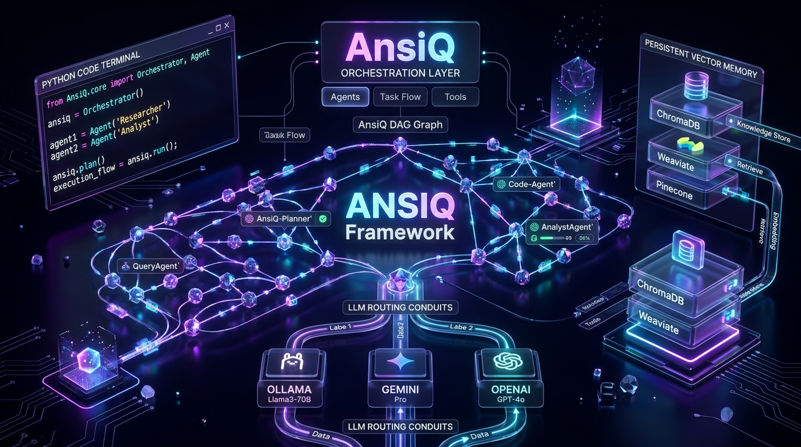

<div align="center">

# 🌌 Shaik Mastan Vali — Portfolio

### **Full-Stack Engineer & AI/ML Systems Architect**
*Crafting Ultra-Luxury Digital Experiences, Scalable Distributed Systems & Multi-Agent AI Workflows.*

[](https://nextjs.org/)
[](https://react.dev/)
[](https://www.typescriptlang.org/)
[](https://tailwindcss.com/)
[](LICENSE)

<br />



</div>

---

## 🌟 Highlights & Signature Engineering

- 🌊 **Interactive Zen Koi Canvas**: Smooth multi-layered procedural physics, custom fluid caustics, and dynamic water ripples running at 60 FPS on HTML5 Canvas.
- ⚡ **Next-Gen App Architecture**: Built with Next.js 15 App Router, zero hydration mismatch, dynamic routing, and instant client-side transitions.
- 🎨 **Luxury Glassmorphism & Specular Auras**: Bespoke obsidian aesthetics, ambient stardust particle physics, and crystal refraction visual design.
- 📱 **Adaptive Omnichannel UI**: Pixel-perfect responsive rendering across Mobile, Tablet, Laptop, and Ultra-Wide screens.
- 🛡️ **Zero Runtime Errors**: 100% Type-Safe TypeScript, fully audited production builds with zero CSS warnings.

---

## 🏗️ Repository Architecture & Asset Tree

```text
📁 Mastanvali-_Portfolio/
├── 📁 public/
│   ├── 📁 images/
│   │   ├── 📁 projects/          # High-fidelity project screenshots & 3D renders
│   │   └── 📁 avatar/            # Vector & photograph persona assets
│   ├── 📁 fonts/                 # Bespoke typography and web fonts
│   └── 📄 robots.txt             # SEO Crawling directives
├── 📁 src/
│   ├── 📁 app/                   # Next.js 15 App Router (Pages, Layouts & APIs)
│   │   ├── 📄 page.tsx           # Portfolio Home
│   │   └── 📄 globals.css        # Luxury design tokens, animations & tailwind layers
│   ├── 📁 components/            # Production UI & Dynamic Interactive Modules
│   │   ├── 📁 character/         # Laptop skill stream & particle physics
│   │   ├── 📁 creator/           # Hero, Zen Koi Pond, Project Showcases & Obsidian Footer
│   │   ├── 📁 shared/            # Reusable luxury widgets & navigation dock
│   │   └── 📁 ui/                # Top progress bar, buttons, dialogs & cards
│   ├── 📁 hooks/                 # Custom React hooks (smooth scroll, canvas dimensions)
│   ├── 📁 types/                 # Strict TypeScript schemas & interfaces
│   └── 📁 data/                  # Dynamic content, project records & achievements
├── 📄 next.config.ts             # Performance headers & image optimization rules
├── 📄 tailwind.config.ts         # Luxury color palette & keyframe definitions
├── 📄 tsconfig.json              # Strict TypeScript compiler options
├── 📄 LICENSE                    # Official MIT License
└── 📄 README.md                  # Project overview & documentation
```

---

## 💼 Featured Engineering Projects

| Project | Domain | Architecture Highlights |
| :--- | :--- | :--- |
| **Ansiq AI** | Multi-Agent Orchestration | Distributed LangGraph agent DAGs, real-time telemetry streaming |
| **QodeSync** | Cloud Developer Platform | High-concurrency GitHub CI/CD synchronizer, edge caching |
| **Anasify ATS** | AI Resume Intelligence | Deep semantic ATS matching, LLM feedback loop, vector search |
| **Anpharmacy ERP** | Enterprise Healthcare | Multi-tenant inventory management, real-time analytics dashboards |

---

## 🚀 Getting Started

### 1. Clone the repository
```bash
git clone https://github.com/anas116-ai/Mastanvali-_Portfolio.git
cd Mastanvali-_Portfolio
```

### 2. Install dependencies
```bash
npm install
```

### 3. Run development server
```bash
npm run dev
```
Open [http://localhost:3000](http://localhost:3000) to view the live portfolio.

### 4. Production Build
```bash
npm run build
```

---

## 📜 License

Distributed under the **MIT License**. See [`LICENSE`](LICENSE) for more information.

<div align="center">
  <sub>Crafted with passion & precision by <strong>Shaik Mastan Vali</strong>.</sub>
</div>
