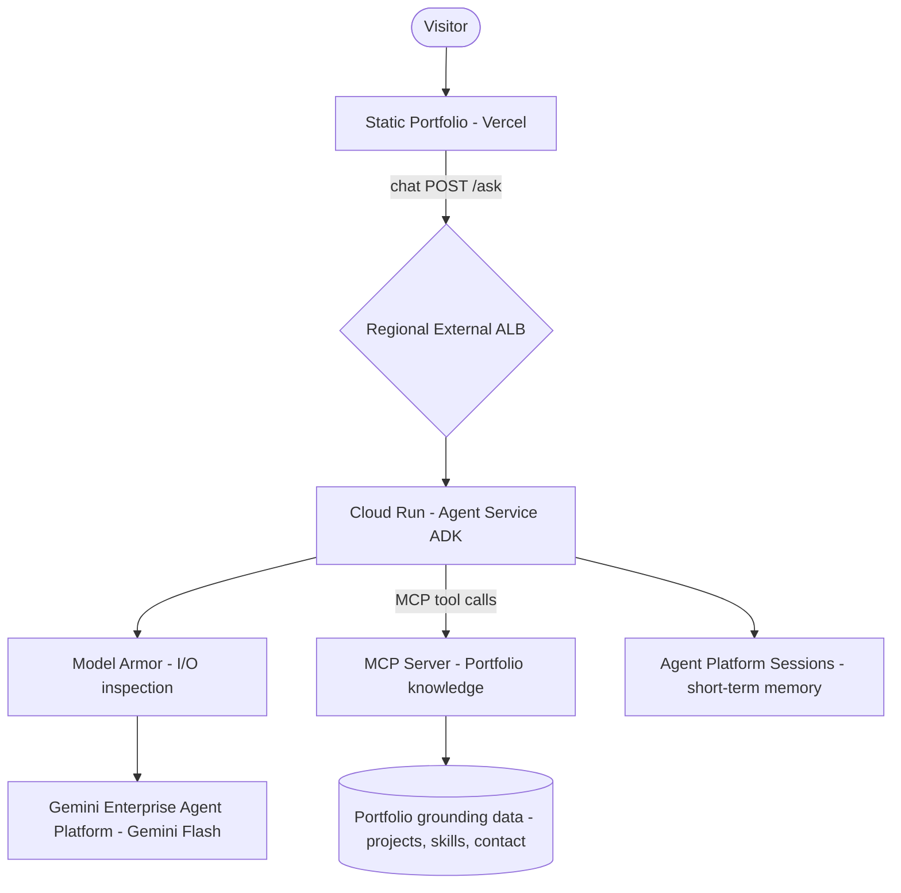

# Google Cloud solution architecture: Portfolio Assistant Agent

## 1. Executive summary and workload overview

A single-agent conversational assistant, embedded as a "Ask about Shaik" widget on
the portfolio website `shaikmastanvali.dev`. It answers grounded questions about
Shaik's projects (AnPharmacy, AnsiQ, Anasify, Qode-Sync), skills (SAP BODS/ETL,
AI agent frameworks, full-stack), and experience. The assistant is designed for a
typical visitor question volume (long-tail, low concurrency), so the architecture
favours low operational cost and scales to zero when idle.

Design pattern: **single-agent** — the workload is one bounded Q&A task with one
knowledge source; a multi-agent system would add coordination overhead with no
benefit at this scale.

## 2. Requirements and current state

### 2.1. Functional requirements

- **Business processes**: Website visitors discover Shaik's skills and projects
  and can start a conversation (Hire Me flow) directly from the chat.
- **Activities and use cases**:
  - Visitor asks "what projects has Shaik built?"
  - Recruiter asks "what SAP/ETL experience does he have?"
  - Founder asks "has he built AI agents?" or "can he do [skill]?"
  - Visitor asks for contact details or to start a project.
  - Assistant escalates to a `mailto:` / Hire Me CTA when intent is hiring.

### 2.2. Non-functional requirements

- **Security**: No user data stored; prompt output inspection enabled (Model
  Armor); credentials only via encrypted environment variables.
- **Reliability**: Best effort availability; RTO ~ 10 min on redeploy; no
  persistent state to back up.
- **Cost**: Near-zero idle cost is the top priority (scale-to-zero Cloud Run).
- **Operations**: Single-region deployment; Cloud Logging for traces; automated
  redeploy from the portfolio repo (Vercel for static, Cloud Run for agent).
- **Performance**: p95 response < 5 s; concurrent users expected < 20.
- **Sustainability**: Serverless, scales to zero — minimal idle footprint.

### 2.3. Current state

- **Current infrastructure**: Static Next.js portfolio hosted on Vercel; no
  backend or AI component today.
- **Pain points and drivers**: Website is fully static; visitors with deep
  questions must read manually. A grounded assistant improves conversion to
  hiring without a live human.

### 2.4. Dependencies

- **Internal dependencies**: Portfolio repo content as grounding data.
- **External dependencies**: Gemini API (via Agent Platform); no on-prem systems.

## 3. Technical decomposition of the workload

| Component          | Responsibility                                              |
| :----------------- | :---------------------------------------------------------- |
| Web frontend       | Static Next.js portfolio + embedded chat widget (`Ask Shaik`) |
| Agent service      | Conversation loop: prompt → model → tool call → respond      |
| Grounding/tools    | MCP server exposing portfolio knowledge as tools (projects, skills, experience, contact) |
| Model runtime      | LLM inference + input/output inspection (Model Armor)        |

## 4. Proposed solution architecture

### 4.1. Google Cloud products and features mapping

| Component          | Recommended                 | Justification                                                                 | Alternatives        | Pros and cons of alternatives                          |
| :----------------- | :-------------------------- | :---------------------------------------------------------------------------- | :------------------ | :----------------------------------------------------- |
| Agent development  | Agent Development Kit (ADK) | First-party agent framework for prompt/tool/stateful agent nodes              | LangChain, CrewAI    | **Pros**: flexible/ecosystem. **Cons**: no managed agent runtime integration |
| Agent runtime      | Cloud Run                  | Scales to zero (cost), hosts the agent + MCP server as containers            | Gemini Enterprise Agent Runtime | **Pros**: managed sessions. **Cons**: region/language limits; can't host custom MCP servers directly |
| Agent memory       | Agent Platform Sessions    | Built-in short-term memory for the agent                                      | Memorystore Redis    | **Pros**: sub-ms. **Cons**: ops + fixed cost, overkill here |
| Model runtime      | Gemini Enterprise Agent Platform | Serves Gemini Flash (text) through the agent                                | Cloud Run + Gemma    | **Pros**: self-hosted open model. **Cons**: can't serve Gemini models |
| Model selection    | Gemini Flash               | Fast, cheap, correct for structured grounded Q&A                             | Gemini Pro           | **Pros**: stronger reasoning. **Cons**: higher cost/latency |
| Model I/O inspect  | Model Armor                | Mandatory safety filtering on inputs and outputs                              | —                    | —                                                       |
| Agent tools        | Custom MCP server on Cloud Run | Exposes portfolio knowledge (projects/skills/contact) as MCP tools, reusable and decoupled | Built-in web fetch  | **Pros**: zero custom code. **Cons**: raw web content, weaker grounding |
| Frontend (agent)   | Cloud Run (agent) + Vercel (static site) | Static site stays on Vercel; only the chat widget calls Cloud Run | Firebase App Hosting | **Pros**: single pipeline. **Cons**: less container control |

### 4.2. Architecture diagram

### 4.3. Architecture description

- **Data flow**: Visitor message → cloud widget → ALB → Cloud Run agent. Agent
  calls Gemini Flash (through Model Armor) and tools via the MCP server that
  reads portfolio grounding data. Each conversation gets session memory from
  Agent Platform Sessions.
- **Control flow**: Single request/response loop: the ADK agent takes the prompt,
  calls the model, returns either a final answer or a tool-execution request
  (e.g. `list_projects`,`get_skill_detail`), iterating until the answer is
  resolved, then the widget renders it with a Hire Me CTA when intent is hiring.

## 5. Design and configuration recommendations

### 5.1. Security, privacy, and compliance

- Model Armor enabled on the model path (prompt + response inspection).
- No PII stored; Sessions memory TTL kept short (e.g. 1 hour).
- Secrets (API keys, region endpoints) via Cloud Run **encrypted environment
  variables** — never plain text so logs won't leak credentials.

### 5.2. Reliability

- Cloud Run min-instances = 0, so there's no always-on footprint; cold start
  ~ accepted (widget shows typing state).
- Stateless agent; redeploy from repo on failure.

### 5.3. Operational excellence

- Cloud Logging captures request traces + Model Armor violations.
- Terraform (IaC) for Cloud Run service, ALB, and Model Armor policy.
- Optional Agents CLI (`agents-cli scaffold/deploy/run/eval`) to manage the ADK
  project and CI/CD.

### 5.4. Cost optimization

- Cloud Run `min-instances: 0` + `concurrency: 80` → idle cost ≈ $0.
- Gemini Flash is the cheapest capable model; Sessions memory is low-ops.

### 5.5. Performance efficiency

- Grounding data kept small/static (few KB) — no vector DB needed at this scale.
- Chat widget lazy-loads; cold starts masked with typing indicator.

### 5.6. Sustainability

- Serverless scale-to-zero keeps idle carbon near zero.